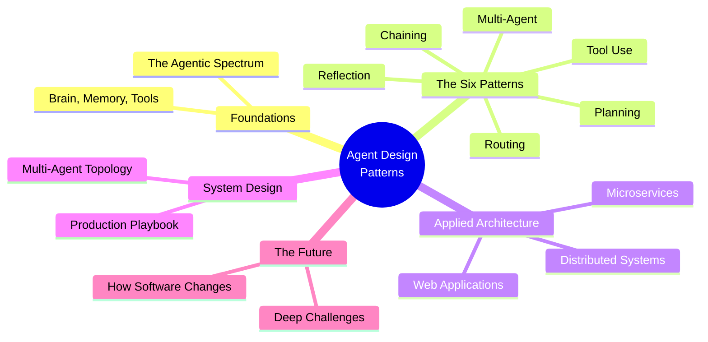

---
hide:
  - navigation
  - toc
---

# Agent Design Patterns

### A visual guide to agentic systems in modern software architecture

Based on 15 research papers and engineering publications from Anthropic, DeepLearning.AI, and leading academic surveys (2023-2025).

---

---

## Read the Series

### Foundations

| | Chapter | Focus |
|---|---------|-------|
| 1 | [The Agentic Spectrum](posts/01-the-agentic-spectrum.md) | Definitions, components, three pillars |
| 2 | [The Six Patterns](posts/02-the-six-patterns.md) | All patterns in one visual comparison |

### Applied Architecture

| | Chapter | Focus |
|---|---------|-------|
| 3 | [Distributed Systems](posts/03-agents-in-distributed-systems.md) | Consensus, fault tolerance, coordination |
| 4 | [Microservices](posts/04-agents-in-microservices.md) | Service mesh, orchestration, observability |
| 5 | [Web Applications](posts/05-agents-in-web-applications.md) | Frontend, backend, full-stack agent flows |

### System Design

| | Chapter | Focus |
|---|---------|-------|
| 6 | [Multi-Agent Architecture](posts/06-multi-agent-system-architecture.md) | Topologies, communication, scaling |
| 7 | [Production Playbook](posts/07-production-playbook.md) | Guardrails, cost, safety, observability |

### The Future

| | Chapter | Focus |
|---|---------|-------|
| 8 | [How Software Changes](posts/08-the-future-of-software-systems.md) | Architecture evolution with agents |
| 9 | [Deep Challenges](posts/09-deep-challenges.md) | Compounding errors, evaluation, safety, trust |

---

## Sources

| Source | Type |
|--------|------|
| Anthropic -- *Building Effective Agents* (2024) | Engineering |
| Lilian Weng -- *LLM Powered Autonomous Agents* (2023) | Technical blog |
| Andrew Ng -- *Agentic Design Patterns* (2024) | Industry |
| Xi et al. -- arXiv:2309.07864 | Survey |
| Wang et al. -- arXiv:2308.11432 | Survey |
| Guo et al. -- arXiv:2402.01680 | Survey |
| Yao et al. -- *ReAct* / Shinn et al. -- *Reflexion* | Papers |
| Hong et al. -- *MetaGPT* / Wu et al. -- *AutoGen* | Papers |
| Park et al. -- *Generative Agents* | Paper |
