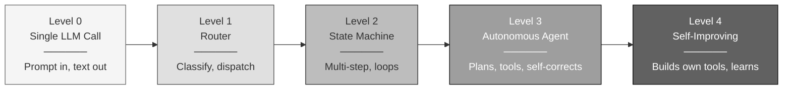
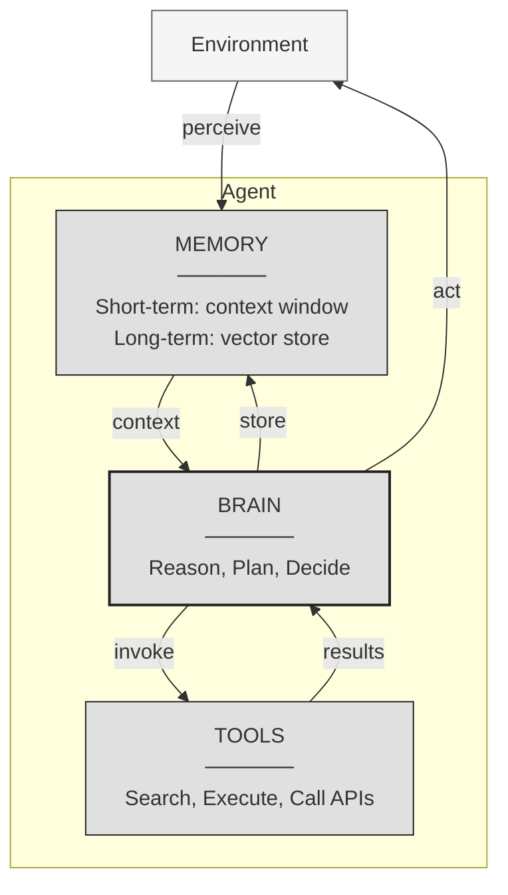
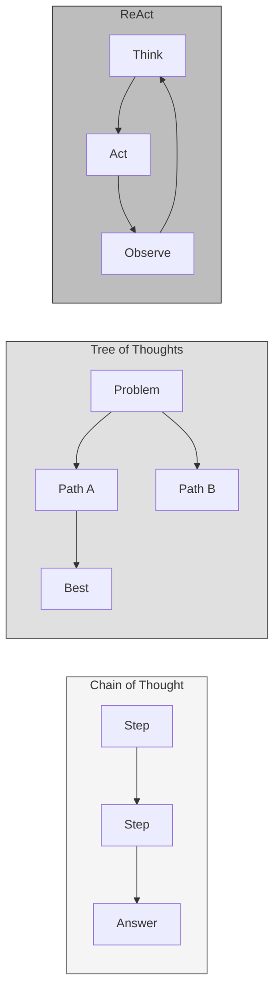
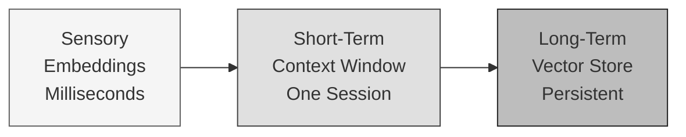

# The Agentic Spectrum

<small>Part 1 of 9 in the **Agent Design Patterns** series</small>

---



---

## Three Pillars



---

## Planning Techniques at a Glance



| Technique | Mechanism | Best For |
|-----------|-----------|----------|
| CoT | Linear decomposition | Arithmetic, logic |
| ToT | Branching exploration | Creative, multi-path problems |
| ReAct | Interleaved reasoning + action | Tool-dependent tasks |

---

## Memory Layers



---

```
 Agentic is not a label. It is a dial.
 Turn it up only when the task demands it.
```
