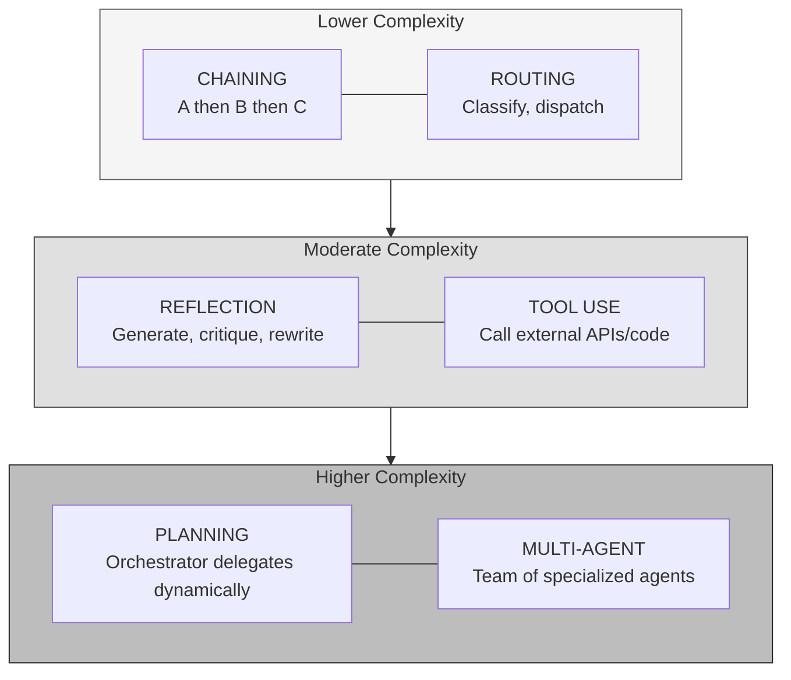
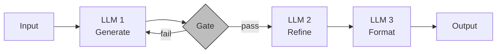
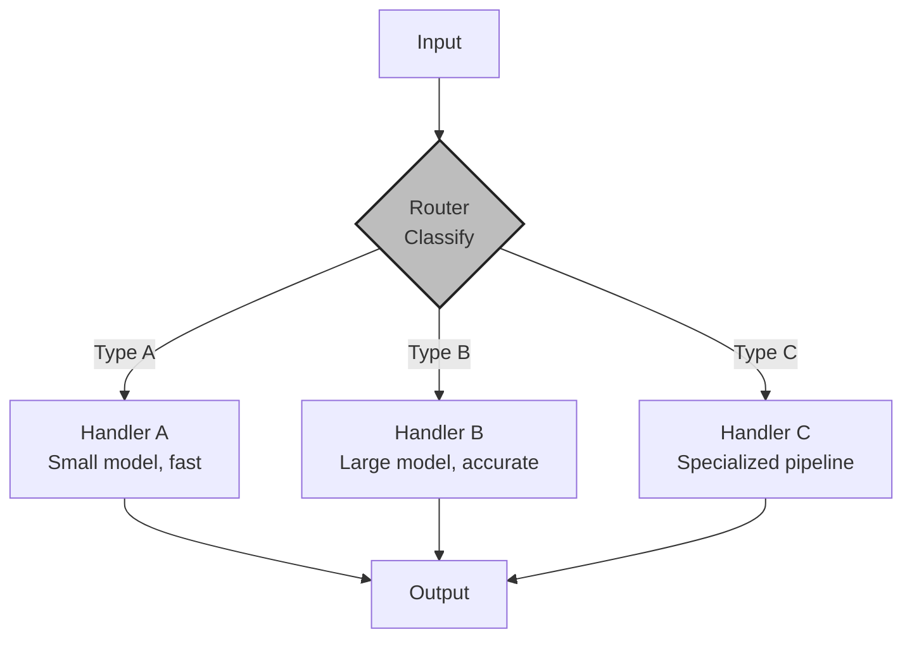
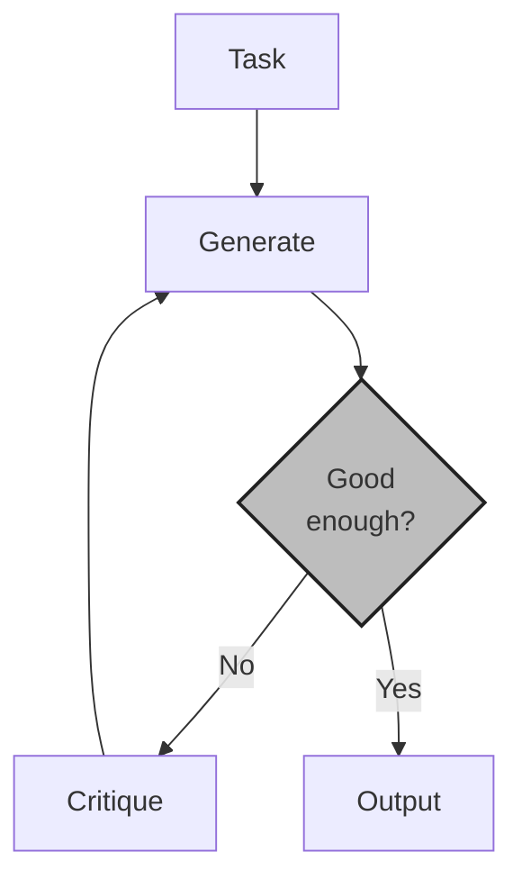
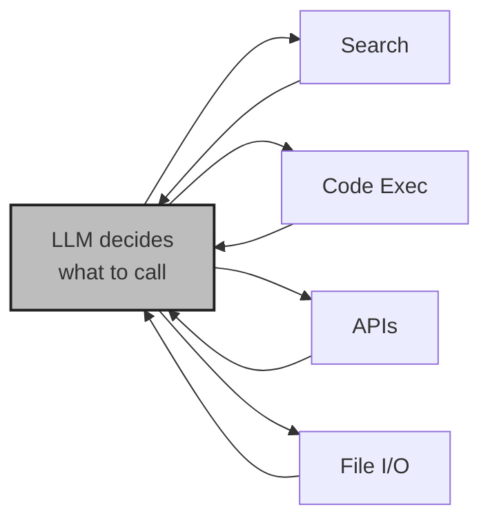
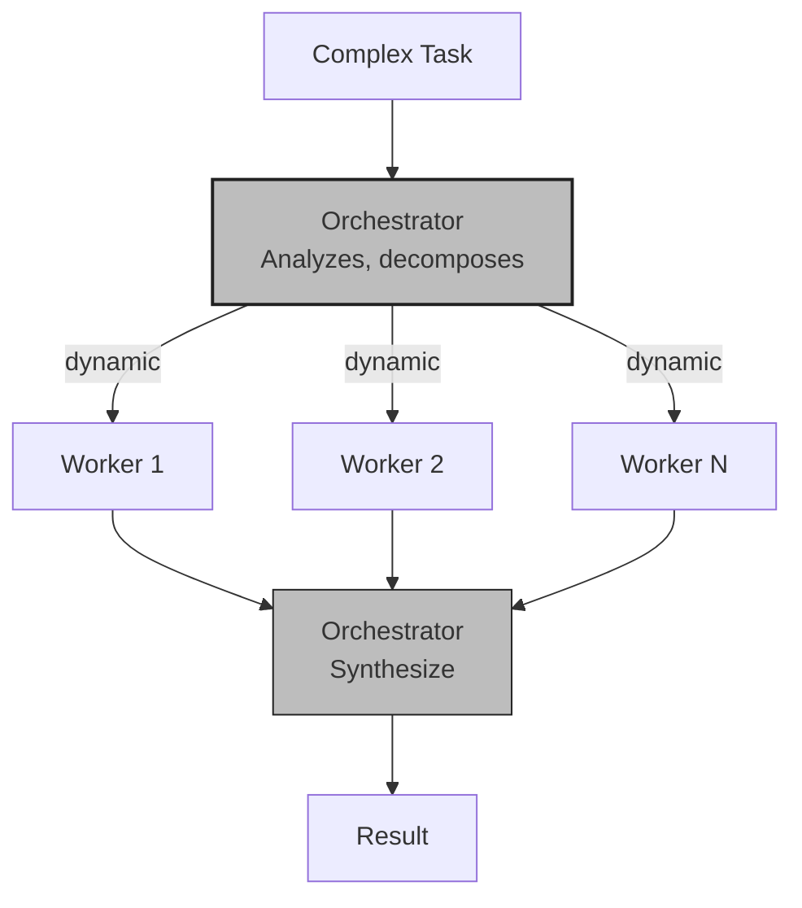
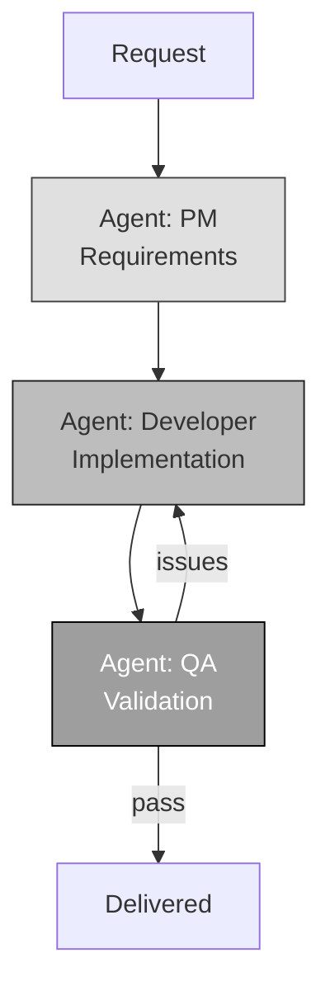
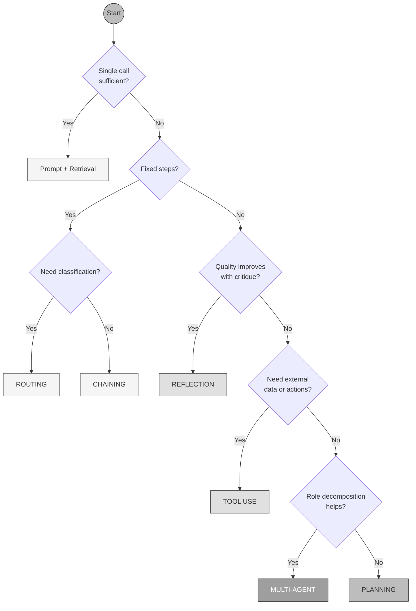

# The Six Patterns

<small>Part 2 of 9 in the **Agent Design Patterns** series</small>

---

## Overview

---

## 1. Prompt Chaining

Fixed pipeline. Each step feeds the next. Gates catch failures between steps.

---

## 2. Routing

Separation of concerns. Optimize each path independently.

---

## 3. Reflection

Highest ROI pattern. GPT-3.5 with reflection (95.1%) surpasses GPT-4 zero-shot (67.0%) on HumanEval.

---

## 4. Tool Use

Without tools, an LLM is a brain without hands.

---

## 5. Planning / Orchestrator-Workers

Subtasks are not predefined. The orchestrator discovers them at runtime.

---

## 6. Multi-Agent

Same LLM, different role prompts. Ablation studies confirm multi-agent outperforms single-agent.

---

## Comparison Matrix

| Pattern | Predictability | Cost | Flexibility | Maturity |
|---------|---------------|------|-------------|----------|
| Chaining | High | Low | None | High |
| Routing | High | Low | Low | High |
| Reflection | Medium-High | Medium | Medium | High |
| Tool Use | Medium | Medium | Medium | High |
| Planning | Medium | High | High | Medium |
| Multi-Agent | Low-Medium | High | High | Emerging |

---

## Selection Flowchart

