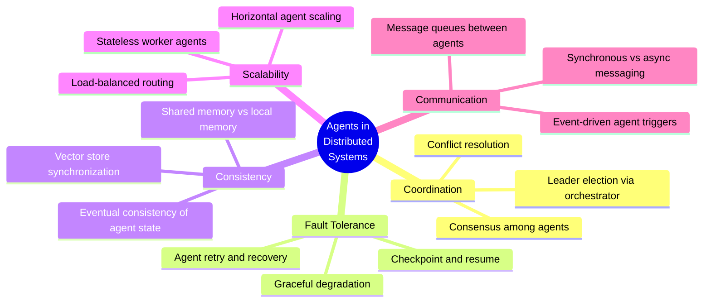
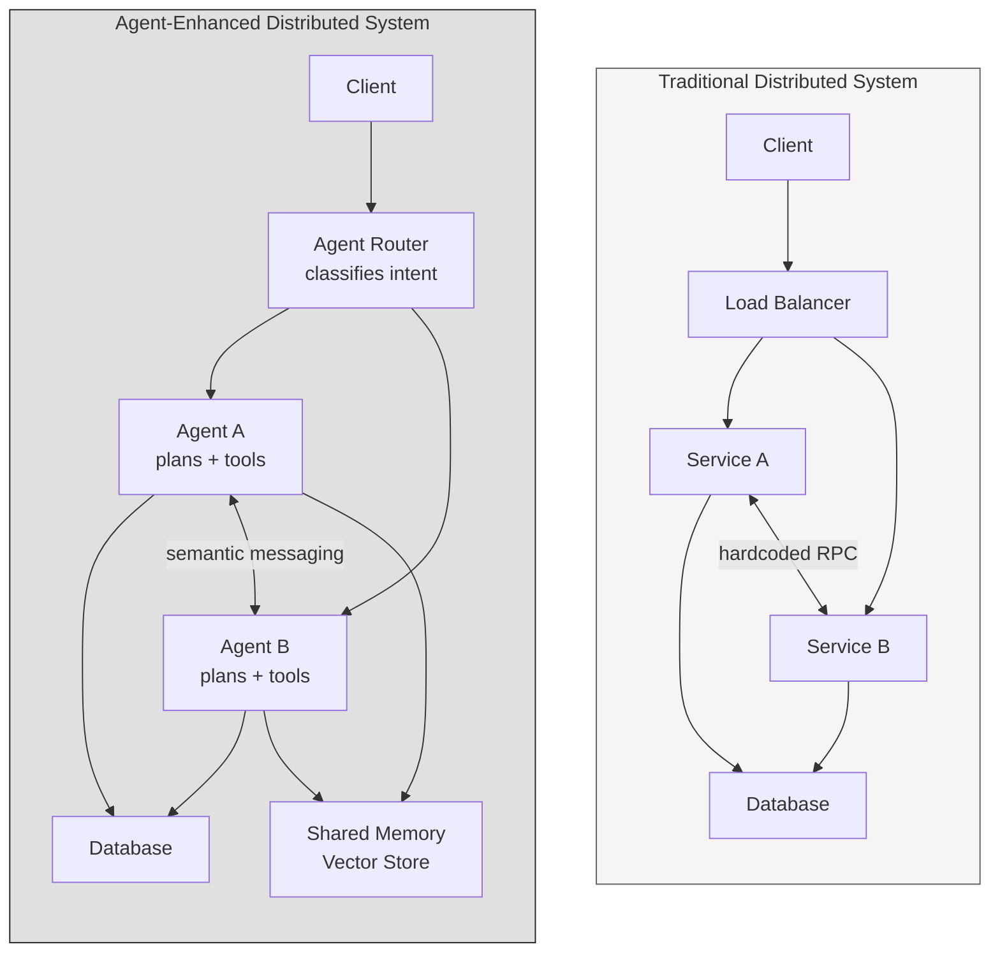
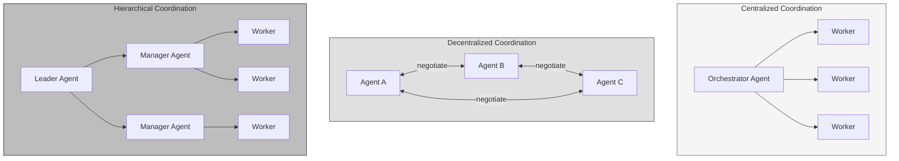
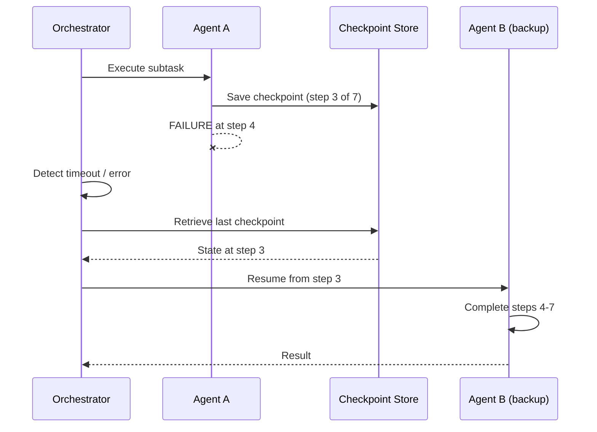
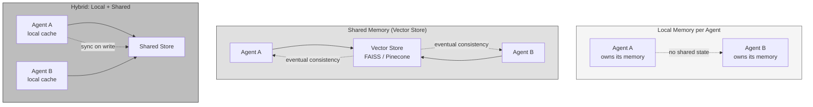
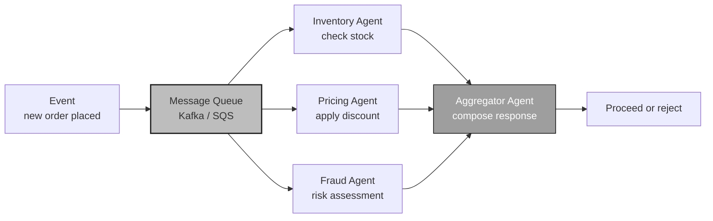
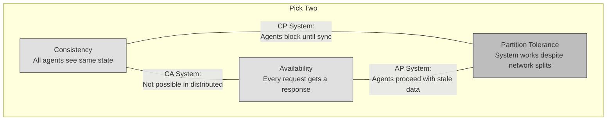

# Agents in Distributed Systems

<small>Part 3 of 9 in the **Agent Design Patterns** series</small>

---

## How Agents Map to Distributed System Concerns



---

## Traditional vs Agent-Enhanced Distributed Architecture



---

## Agent Coordination Patterns



| Pattern | Bottleneck Risk | Fault Tolerance | Complexity |
|---------|----------------|-----------------|------------|
| Centralized | High (single orchestrator) | Low | Low |
| Decentralized | None | High | High |
| Hierarchical | Medium | Medium | Medium |

---

## Fault Tolerance: Agent Recovery



---

## Consistency: Shared vs Local Agent Memory



---

## Event-Driven Agent Communication



---

## CAP Theorem Applied to Agent Systems



Agent systems face the same tradeoffs as any distributed system.
Shared memory introduces consistency challenges.
Independent agents improve availability but risk divergent state.

---

```
 Agents do not eliminate distributed system problems.
 They reframe them: consensus becomes negotiation,
 RPC becomes semantic messaging,
 state machines become reasoning loops.
```
