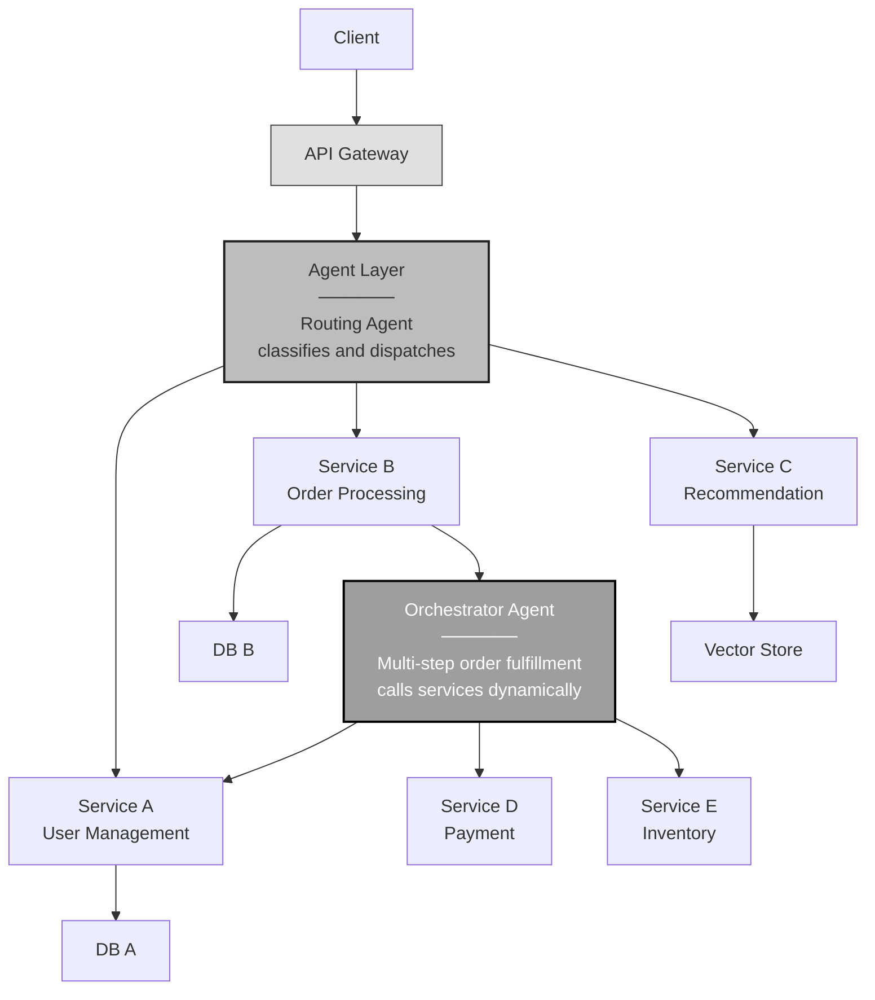
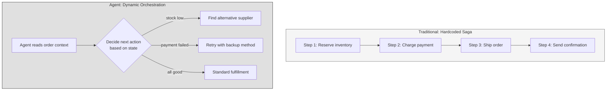
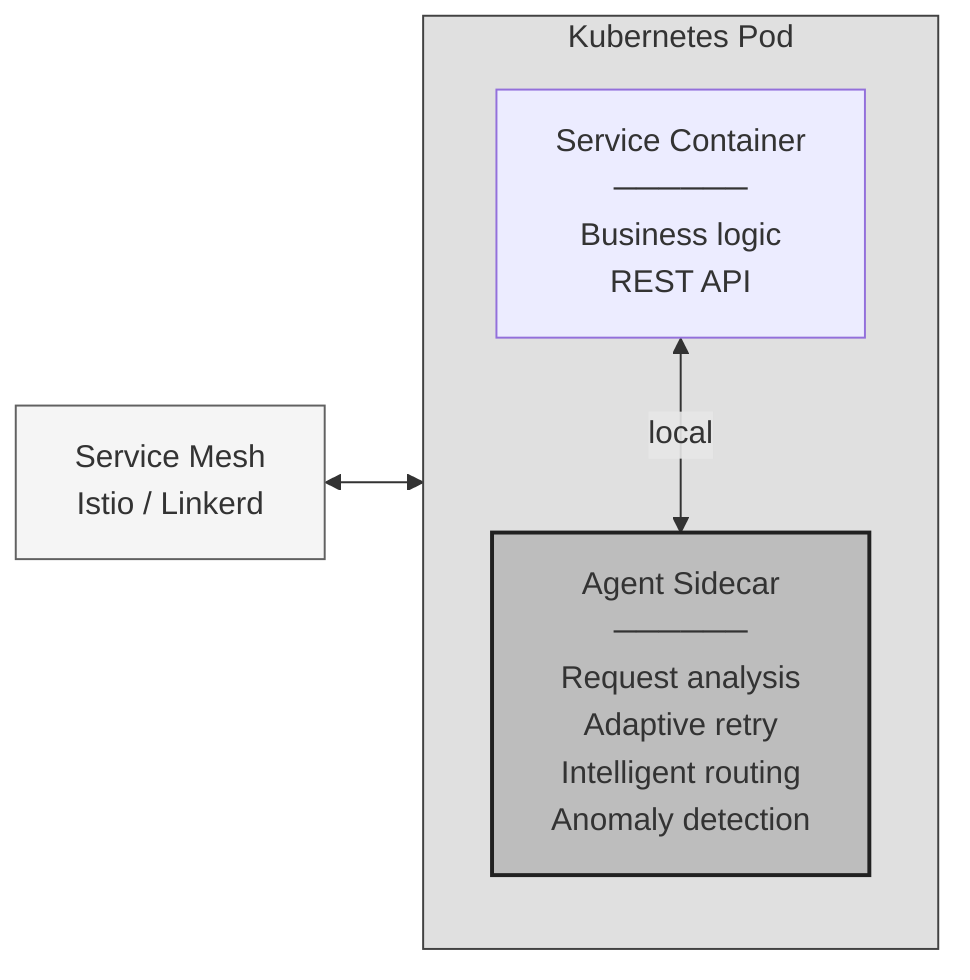
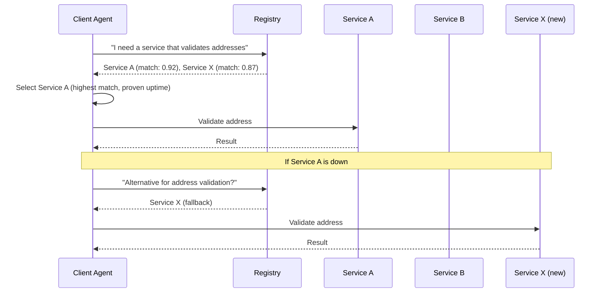
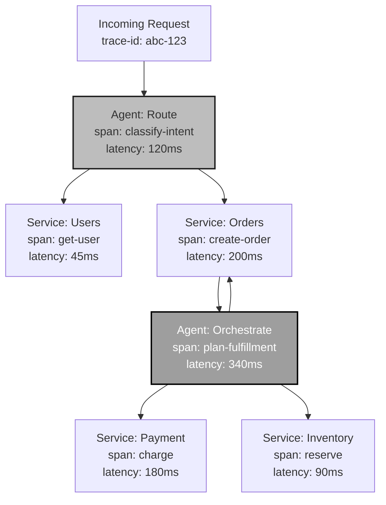
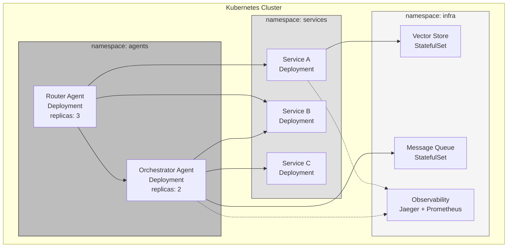

# Agents in Microservice Architecture

<small>Part 4 of 9 in the **Agent Design Patterns** series</small>

---

## Where Agents Fit in a Microservice Stack



---

## Traditional Orchestration vs Agent Orchestration



---

## Agent as Sidecar



An agent sidecar intercepts requests and responses, adding reasoning capabilities
without modifying service code. Analogous to how Envoy proxies add observability.

---

## Agent-Driven Service Discovery



Semantic service discovery: agents query registries by intent, not by endpoint name.
Fallback selection uses reasoning rather than round-robin.

---

## Observability: Agent Traces in a Microservice Call Graph



Agent spans appear alongside service spans in distributed traces.
Every reasoning step, tool call, and retry is a traceable span.

---

## Microservice Patterns Enhanced by Agents

| Classic Pattern | Without Agent | With Agent |
|----------------|---------------|------------|
| **Circuit Breaker** | Fixed thresholds, binary open/close | Agent analyzes error patterns, adaptive thresholds |
| **Saga** | Hardcoded compensation steps | Agent plans compensation dynamically |
| **Service Discovery** | DNS / registry lookup by name | Semantic lookup by intent |
| **API Gateway** | Static routing rules | Intelligent routing by content analysis |
| **Bulkhead** | Fixed resource partitions | Agent reallocates based on load patterns |
| **Retry** | Exponential backoff, fixed | Agent decides if retry is worthwhile given context |

---

## Deployment Topology



---

```
 Agents do not replace microservice patterns.
 They make existing patterns adaptive:
 static rules become dynamic reasoning,
 fixed sagas become planned sequences,
 hardcoded routing becomes intent-based dispatch.
```
