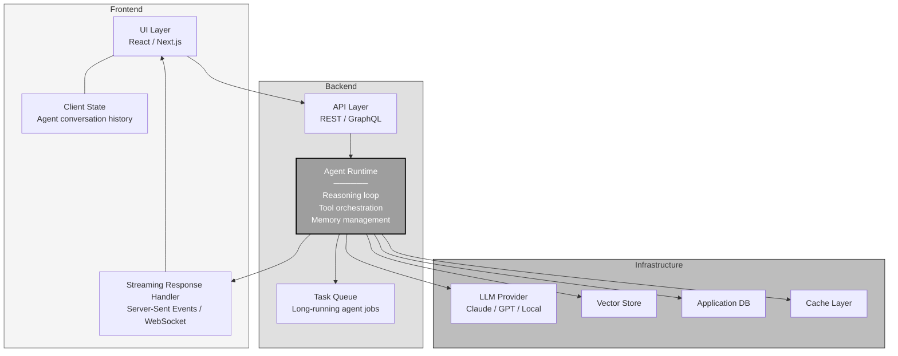
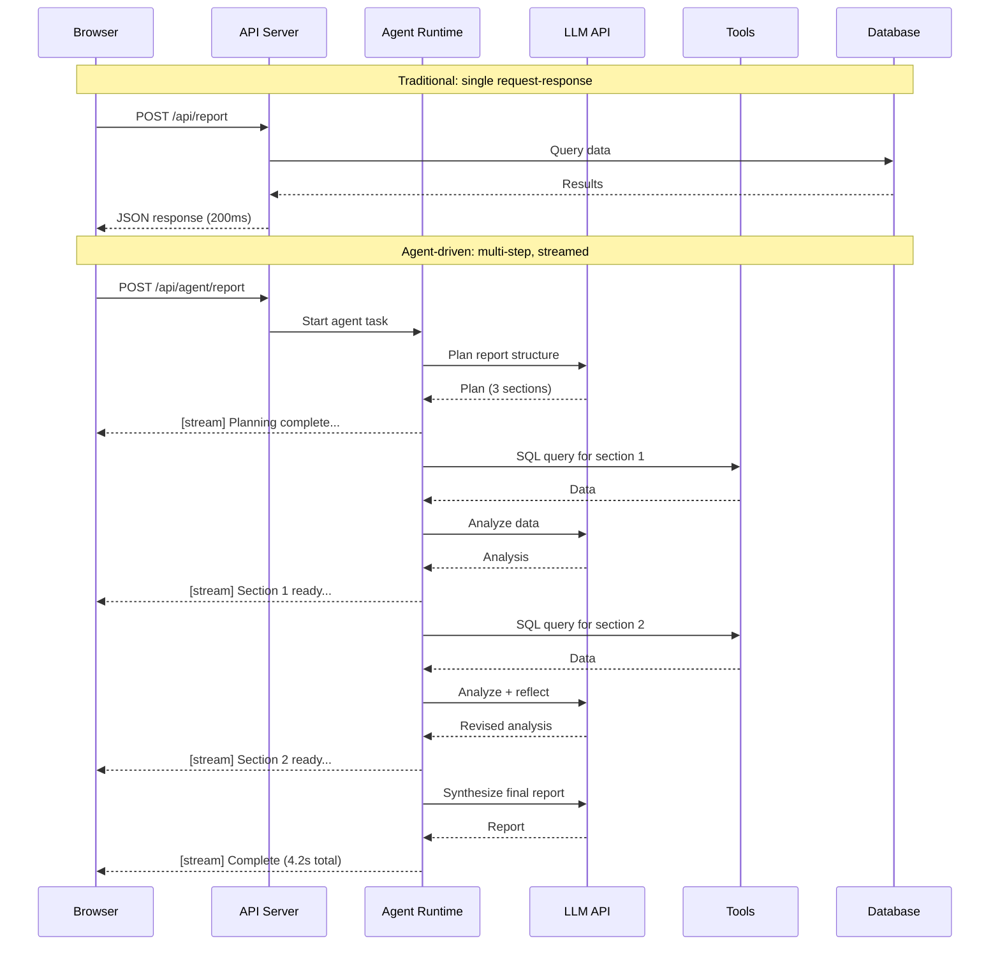
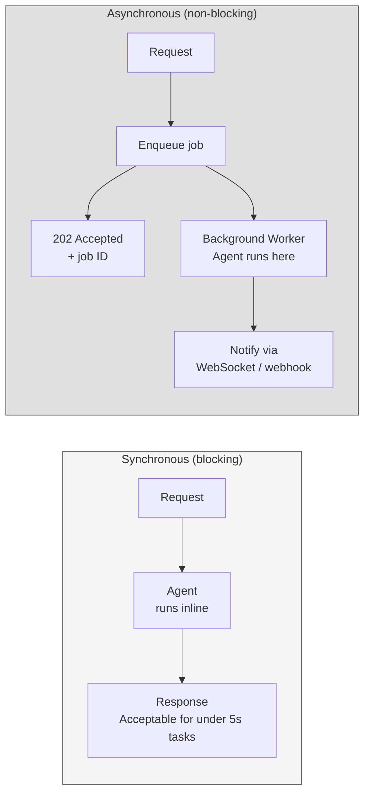
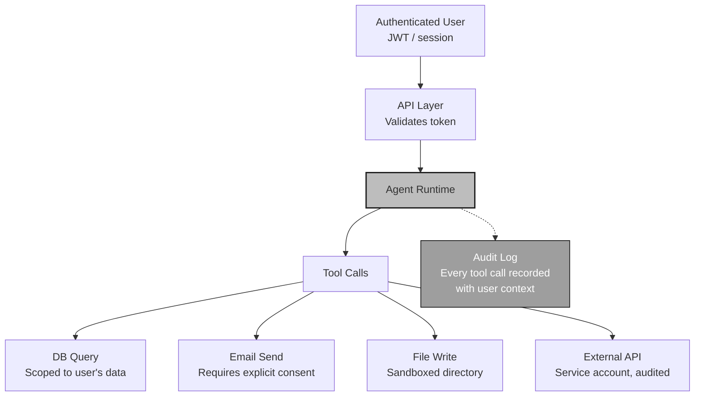
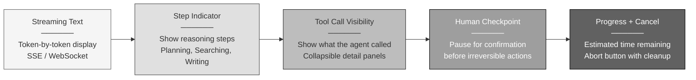

# Agents in Web Applications

<small>Part 5 of 9 in the **Agent Design Patterns** series</small>

---

## Full-Stack Agent Architecture



---

## Request Lifecycle: Traditional vs Agent-Driven



---

## Where Agents Sit in Common Web Architectures

```mermaid
graph TD
    subgraph SPA["Single Page App"]
        SPA_UI["React SPA"] --> SPA_API["API Server"]
        SPA_API --> SPA_AGENT["Agent<br/>as backend service"]
    end

    subgraph SSR["Server-Side Rendered"]
        SSR_UI["Next.js / Nuxt"] --> SSR_AGENT["Agent<br/>in server actions"]
        SSR_AGENT --> SSR_LLM["LLM"]
    end

    subgraph EDGE["Edge + Agent"]
        EDGE_CDN["CDN / Edge"] --> EDGE_ROUTER["Agent Router<br/>at edge"]
        EDGE_ROUTER -->|simple| EDGE_FAST["Cache / static"]
        EDGE_ROUTER -->|complex| EDGE_ORIGIN["Origin + Agent"]
    end

    subgraph REALTIME["Real-Time / Collaborative"]
        RT_WS["WebSocket Server"]
        RT_WS --> RT_AGENT["Agent per session"]
        RT_AGENT --> RT_SHARED["Shared Context Store"]
    end

    style SPA fill:#f5f5f5,stroke:#616161
    style SSR fill:#e0e0e0,stroke:#424242
    style EDGE fill:#bdbdbd,stroke:#212121
    style REALTIME fill:#9e9e9e,stroke:#000,color:#fff
```



---

## Background Agent Jobs



| Approach | Latency Budget | Use Case |
|----------|---------------|----------|
| Synchronous | Under 5 seconds | Classification, routing, simple Q&A |
| Streaming | Under 30 seconds | Report generation, code writing |
| Background + notify | Minutes to hours | Data analysis, batch processing, multi-agent tasks |

---

## Authentication and Authorization for Agent Tools



Every tool call inherits the user's permission scope.
No tool call executes without an audit trail.

---

## Frontend Patterns for Agent UIs



---

```
 Web applications with agents shift from
 request-response to request-observe-stream.
 The frontend becomes a dashboard for agent activity.
 The backend becomes a runtime for agent execution.
```
