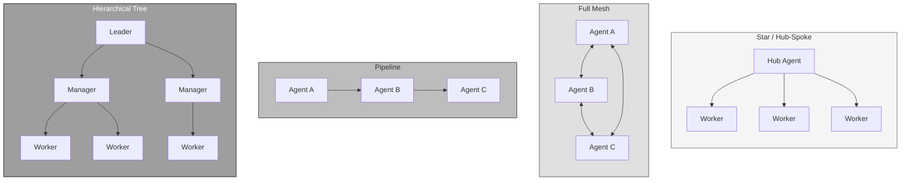
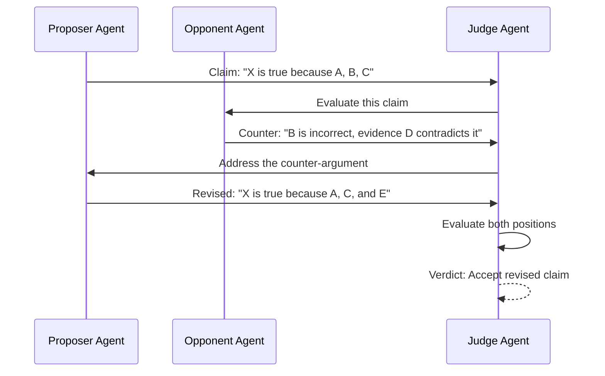
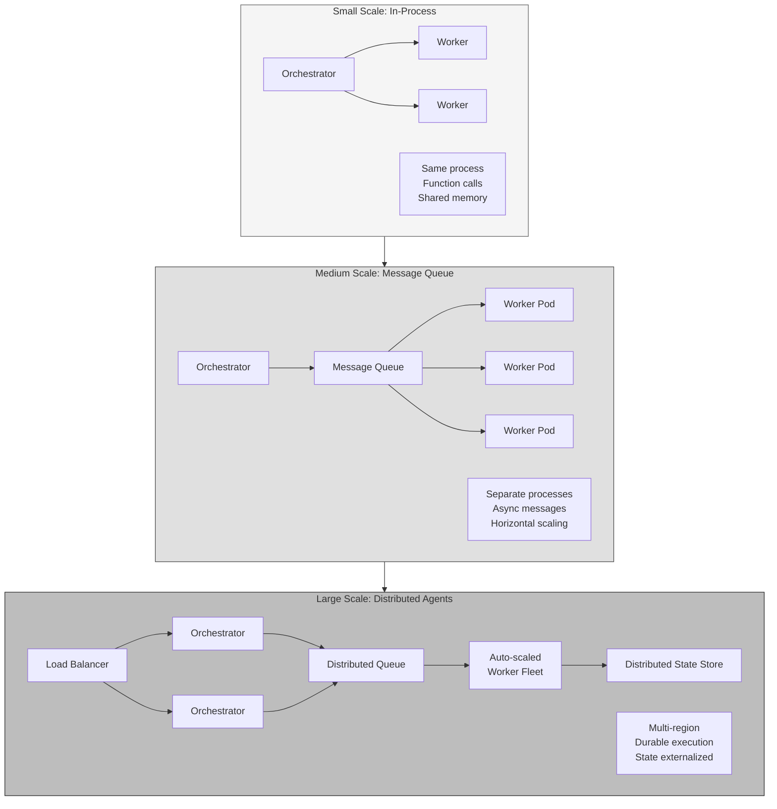
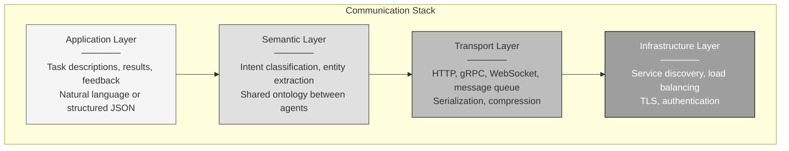
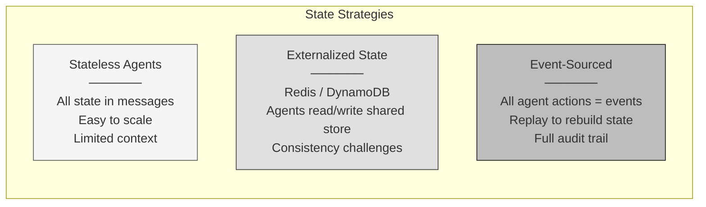
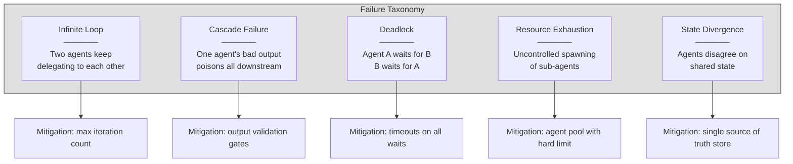

# Multi-Agent System Architecture

<small>Part 6 of 9 in the **Agent Design Patterns** series</small>

---

## Communication Topologies



| Topology | Message Complexity | Fault Tolerance | Best For |
|----------|-------------------|-----------------|----------|
| Star | O(n) | Low (hub is SPOF) | Orchestrated tasks |
| Mesh | O(n^2) | High | Debate, negotiation |
| Pipeline | O(n) | Low | Sequential processing |
| Tree | O(n log n) | Medium | Large-scale delegation |

---

## Debate Pattern: Improving Factual Accuracy



Debate reduces hallucination. Opposing agents surface weaknesses
that self-reflection often misses.

---

## Scaling Multi-Agent Systems



---

## Agent Communication Protocol Layers



---

## State Management in Multi-Agent Systems



| Strategy | Scalability | Debuggability | Complexity |
|----------|------------|---------------|------------|
| Stateless | High | Low | Low |
| Externalized | High | Medium | Medium |
| Event-Sourced | High | High | High |

---

## Failure Modes in Multi-Agent Systems



---

```
 Multi-agent systems are distributed systems.
 They inherit every problem of distributed computing:
 partial failure, network partitions, state consistency.
 Design for failure from the start.
```
