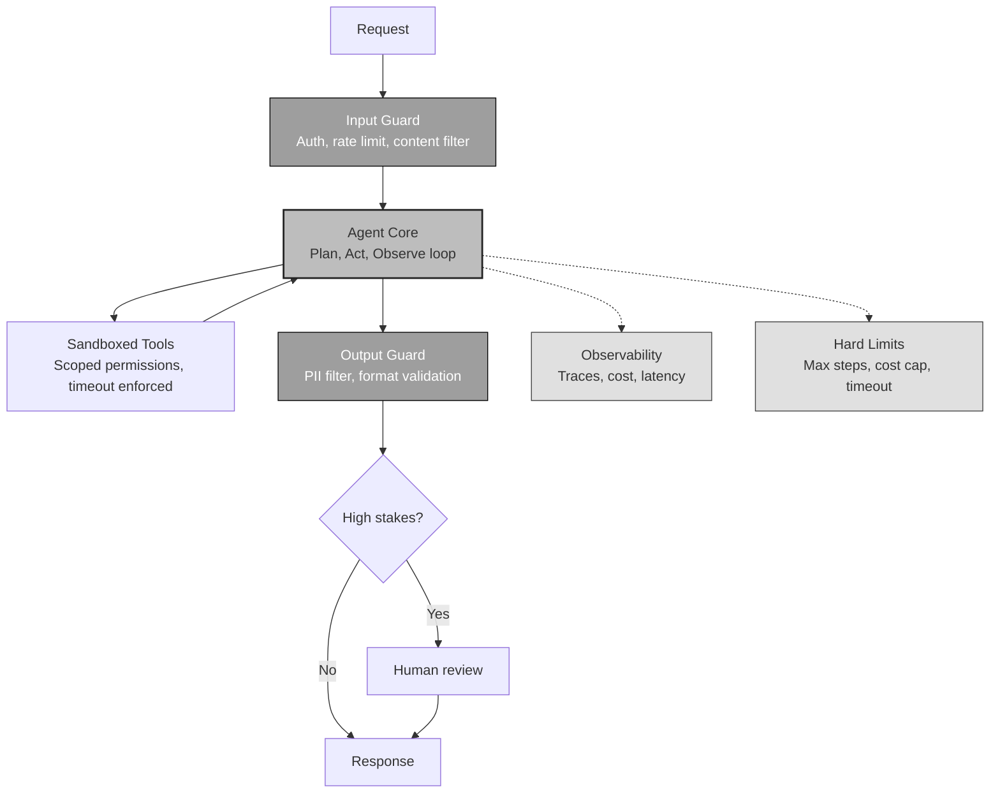
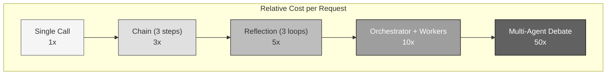

# Production Playbook

<small>Part 7 of 9 in the **Agent Design Patterns** series</small>

---

## Production Agent Architecture



---

## Six Design Principles

```mermaid
graph TB
    subgraph PRINCIPLES[""]
        direction LR
        P1["Constrained<br/>Autonomy<br/>──────<br/>Least privilege<br/>Sandboxed tools<br/>Bounded action space"]
        P2["Human-in-<br/>the-Loop<br/>──────<br/>Checkpoints<br/>Escalation paths<br/>Approval gates"]
        P3["Ground Truth<br/>Feedback<br/>──────<br/>Verify each step<br/>Test results<br/>API status codes"]
        P4["Interface<br/>Design<br/>──────<br/>Clear tool docs<br/>Absolute paths<br/>Actionable errors"]
        P5["Hard<br/>Limits<br/>──────<br/>Max iterations<br/>Cost ceiling<br/>Wall-clock timeout"]
        P6["Full<br/>Observability<br/>──────<br/>Every step traced<br/>Cost per request<br/>Anomaly alerts"]
    end

    style PRINCIPLES fill:#f5f5f5,stroke:#616161
```

---

## Cost Model



---

## Safety Tiers

```mermaid
graph LR
    subgraph TIERS[""]
        T1["Read-Only<br/>──────<br/>Search, analyze<br/>No side effects<br/>Full autonomy"]
        T2["Reversible Write<br/>──────<br/>Create drafts<br/>Save files<br/>Log + review"]
        T3["Irreversible Action<br/>──────<br/>Send emails, deploy<br/>Financial ops<br/>Human approval"]
        T4["Physical World<br/>──────<br/>Lab automation<br/>Robotics<br/>Expert oversight"]
    end

    T1 --> T2 --> T3 --> T4

    style T1 fill:#f5f5f5,stroke:#616161
    style T2 fill:#e0e0e0,stroke:#424242
    style T3 fill:#bdbdbd,stroke:#212121
    style T4 fill:#9e9e9e,stroke:#000,color:#fff
```

---

## Use Case to Pattern Mapping

| Use Case | Pattern | Why |
|----------|---------|-----|
| Email triage | Routing | Discrete categories |
| Report generation | Chaining | Fixed pipeline |
| Code review | Reflection | Quality improves with critique |
| Research task | Planning + Tools | Unpredictable subtasks |
| Software build | Multi-Agent | Role decomposition |
| Content moderation | Parallelization (voting) | Multiple perspectives |
| Customer support | Full Agent | Dynamic conversation + tools + memory |

---

```
 The best agent is the simplest one that works.
 Add complexity only when it demonstrably improves outcomes.
```
