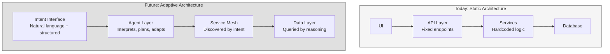
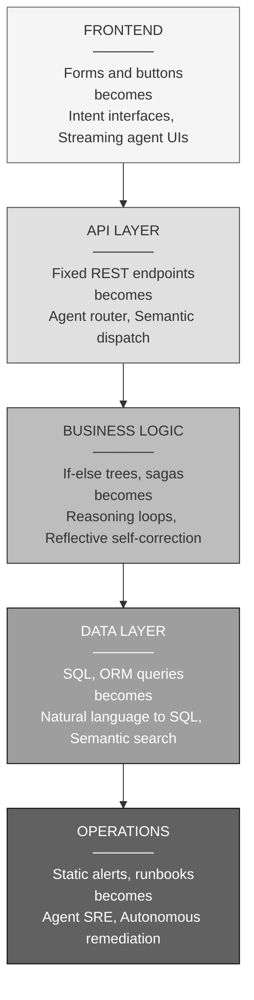
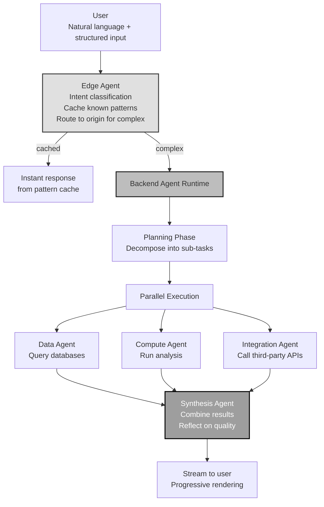
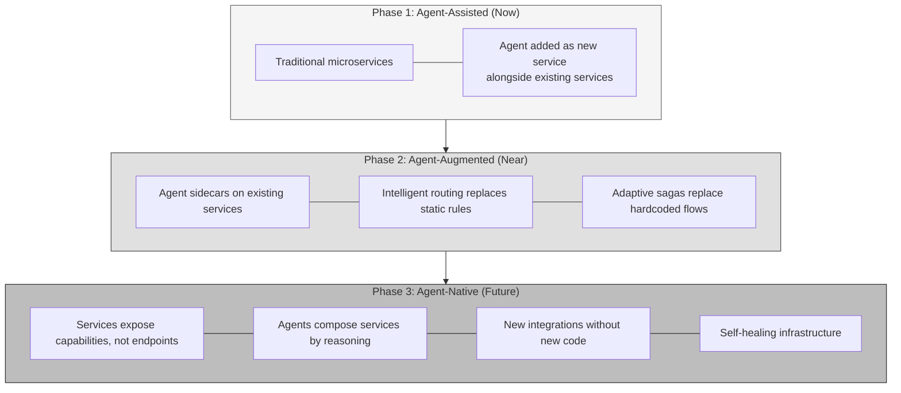
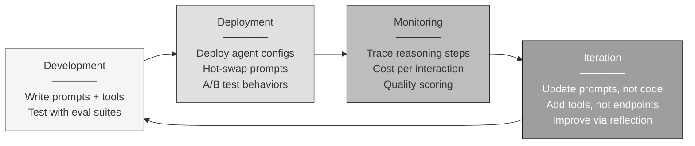
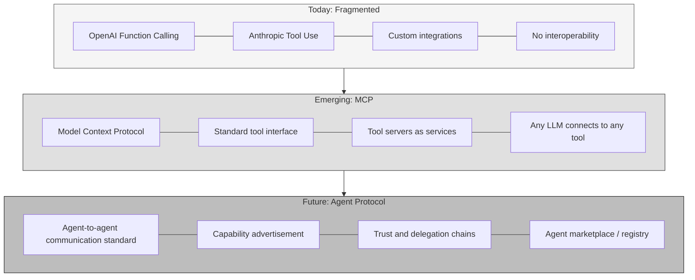
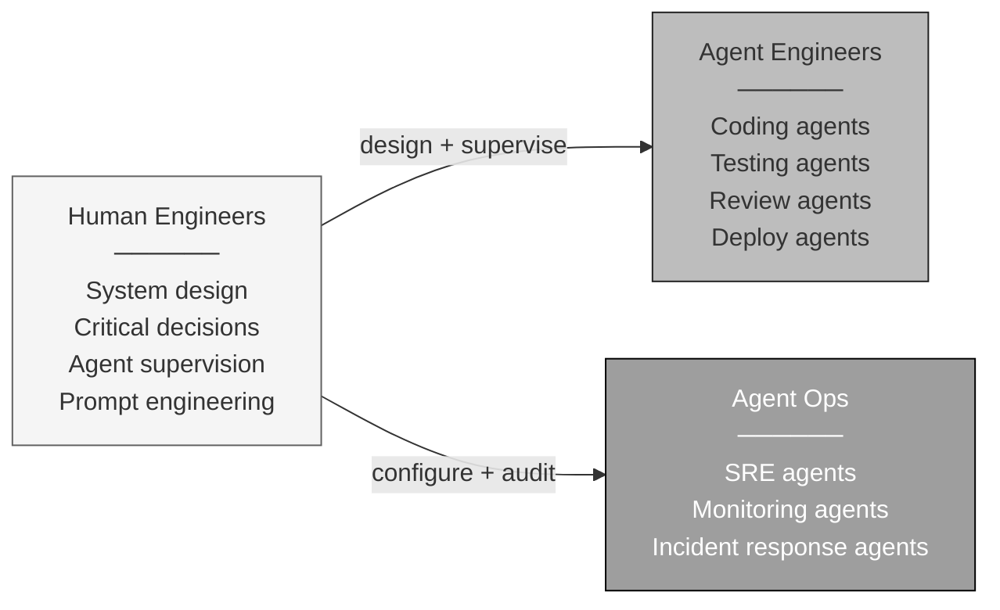

# The Future of Software Systems

<small>Part 8 of 9 in the **Agent Design Patterns** series</small>

---

## How Architecture Changes with Agents



---

## The Shift in Each Layer



---

## Future Web Application Architecture



---

## Future Microservice Evolution



---

## Future Distributed System Patterns

```mermaid
graph TD
    subgraph CONSENSUS["Agent Consensus"]
        AC1["Agent proposes action"]
        AC2["Peer agents validate"]
        AC3["Quorum reached: execute"]
        AC1 --> AC2 --> AC3
    end

    subgraph SELF_HEAL["Self-Healing Cluster"]
        SH1["Monitor agent detects anomaly"]
        SH2["Diagnosis agent identifies root cause"]
        SH3["Remediation agent applies fix"]
        SH4["Verification agent confirms resolution"]
        SH1 --> SH2 --> SH3 --> SH4
    end

    subgraph AUTO_SCALE["Predictive Scaling"]
        AS1["Traffic analysis agent"]
        AS2["Predict load 30 min ahead"]
        AS3["Pre-scale infrastructure"]
        AS1 --> AS2 --> AS3
    end

    style CONSENSUS fill:#f5f5f5,stroke:#616161
    style SELF_HEAL fill:#e0e0e0,stroke:#424242
    style AUTO_SCALE fill:#bdbdbd,stroke:#212121
```



---

## The Agent-Native Development Lifecycle



---

## What Becomes Easier, What Becomes Harder

```mermaid
graph TB
    subgraph EASIER["Becomes Easier"]
        E1["Handling novel inputs"] --- E2["Cross-service orchestration"] --- E3["Natural language interfaces"] --- E4["Adaptive error recovery"] --- E5["Rapid prototyping"]
    end

    subgraph HARDER["Becomes Harder"]
        H1["Deterministic behavior"] --- H2["Cost prediction"] --- H3["Latency guarantees"] --- H4["Security boundary enforcement"] --- H5["Debugging production issues"] --- H6["Compliance and audit"]
    end

    style EASIER fill:#f5f5f5,stroke:#616161
    style HARDER fill:#bdbdbd,stroke:#212121
```



---

## The Protocol Layer: MCP and Beyond



---

## Software Team of the Future



---

```
 Software will not be written differently.
 Software will be structured differently.

 Static logic becomes dynamic reasoning.
 Fixed endpoints become discovered capabilities.
 Coded workflows become planned sequences.

 The architecture does not just run code.
 It runs thought.
```
