# Deep Challenges and Open Problems

<small>Part 9 of 9 in the **Agent Design Patterns** series</small>

---

## Challenge Map

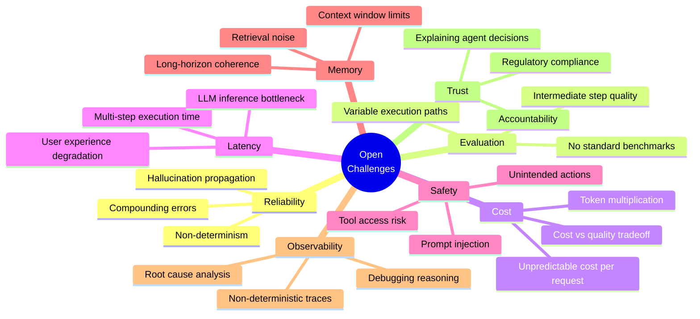

---

## 1. Compounding Errors

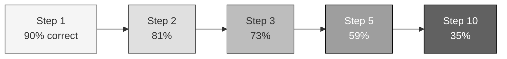

| Steps | Per-step accuracy | Overall success |
|-------|------------------|-----------------|
| 3 | 95% | 85.7% |
| 5 | 95% | 77.4% |
| 10 | 95% | 59.9% |
| 10 | 90% | 34.9% |
| 20 | 90% | 12.2% |

Mitigation strategies:

```mermaid
graph TD
    subgraph MITIGATIONS[""]
        M1["Verification gates<br/>after every step"]
        M2["Minimize step count<br/>fewer steps = fewer failures"]
        M3["Self-correction loops<br/>detect and retry"]
        M4["Ground truth anchors<br/>test results, API responses"]
        M5["Graceful degradation<br/>partial results > no results"]
    end

    style MITIGATIONS fill:#e0e0e0,stroke:#424242
```

---

## 2. Evaluation: The Unsolved Problem

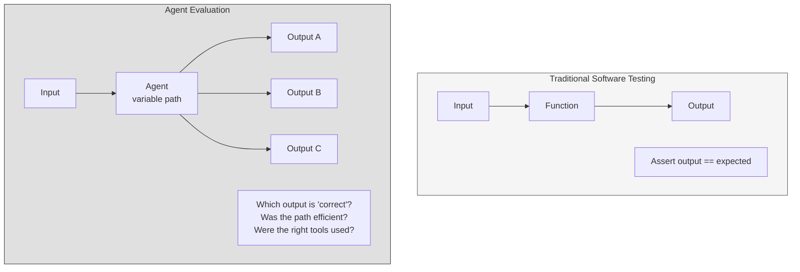

| Dimension | What to Measure | Difficulty |
|-----------|----------------|------------|
| Final output quality | Does the result solve the task? | Medium |
| Path efficiency | Did the agent take unnecessary steps? | Hard |
| Tool selection | Did it pick the right tools? | Hard |
| Cost efficiency | Could it have been done cheaper? | Medium |
| Robustness | Same quality across varied inputs? | Very Hard |
| Safety | Did it avoid harmful actions? | Very Hard |

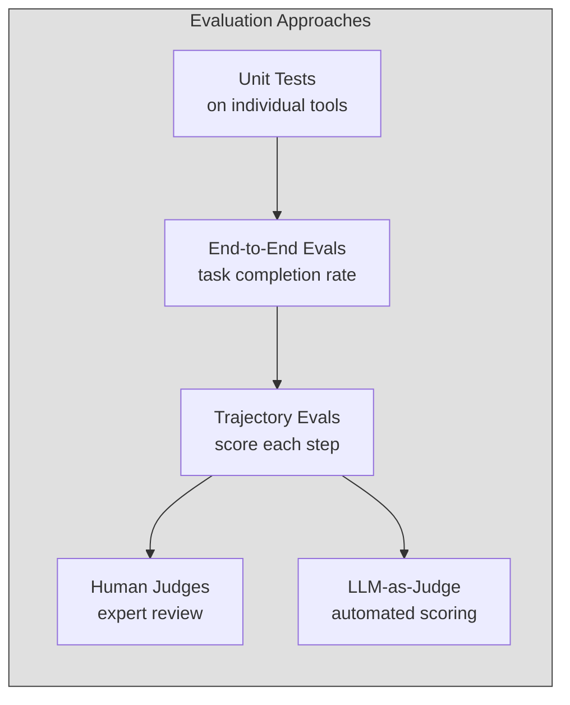

---

## 3. Cost: The Hidden Multiplier

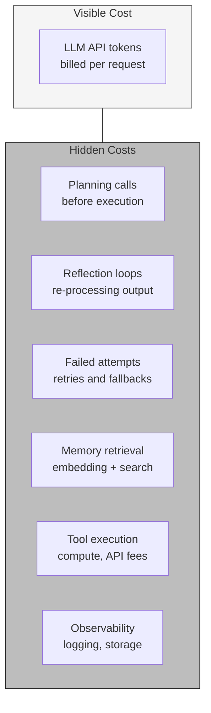

A single user request can trigger 10-50 LLM calls internally.
Cost varies 10x between simple and complex inputs for the same agent.

---

## 4. Latency Budget

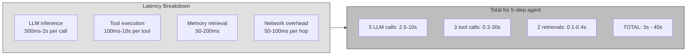

| User Experience | Max Latency | Implication |
|----------------|-------------|-------------|
| Interactive chat | Under 3s | 1-2 LLM calls max |
| Streamed response | Under 10s for first token | Start streaming planning phase |
| Background task | Minutes | Use async + notification |
| Batch processing | Hours | No user waiting |

---

## 5. Safety: Real Attack Vectors

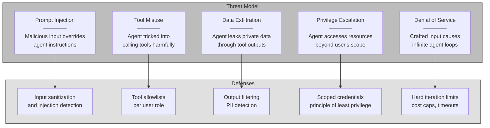

---

## 6. Memory: The Long-Horizon Problem

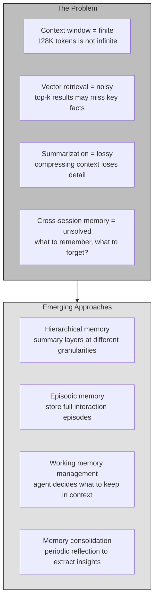

---

## 7. Observability: Debugging Non-Determinism

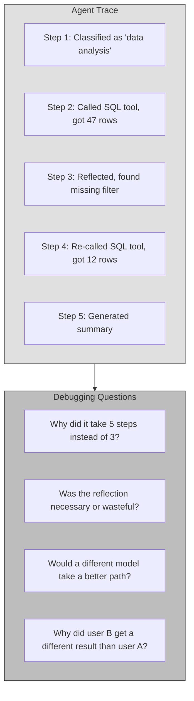

Requirements for agent observability:

```mermaid
graph LR
    subgraph OBS[""]
        O1["Full step traces<br/>every LLM call, tool call, decision"]
        O2["Cost attribution<br/>cost per step, per tool, per request"]
        O3["Replay capability<br/>re-run with same inputs to reproduce"]
        O4["Comparison views<br/>diff two runs of same input"]
        O5["Anomaly detection<br/>flag unusual step counts, costs, paths"]
    end

    style OBS fill:#e0e0e0,stroke:#424242
```

---

## 8. Trust and Accountability

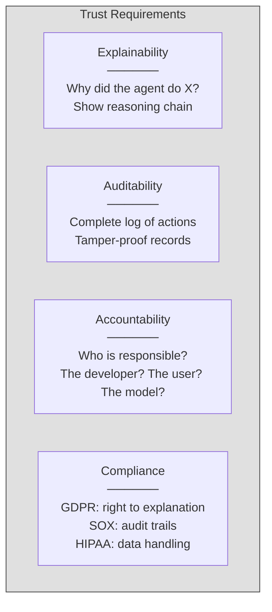

---

## Challenge Maturity Map

```mermaid
graph LR
    subgraph SOLVED["Mostly Solved"]
        S1["Basic tool calling"]
        S2["Single-step reflection"]
        S3["Prompt chaining"]
    end

    subgraph PROGRESS["Active Progress"]
        P1["Multi-agent coordination"]
        P2["Cost optimization"]
        P3["Streaming UIs"]
        P4["Observability tooling"]
    end

    subgraph OPEN["Wide Open"]
        O1["Long-horizon memory"]
        O2["Agent evaluation standards"]
        O3["Safety guarantees"]
        O4["Agent-to-agent trust"]
        O5["Regulatory frameworks"]
    end

    SOLVED --> PROGRESS --> OPEN

    style SOLVED fill:#f5f5f5,stroke:#616161
    style PROGRESS fill:#e0e0e0,stroke:#424242
    style OPEN fill:#bdbdbd,stroke:#212121
```

---

```
 The challenges are not reasons to avoid agents.
 They are the engineering problems that define
 the next generation of software infrastructure.

 Whoever solves observability, evaluation, and safety
 for agentic systems builds the next AWS.
```
